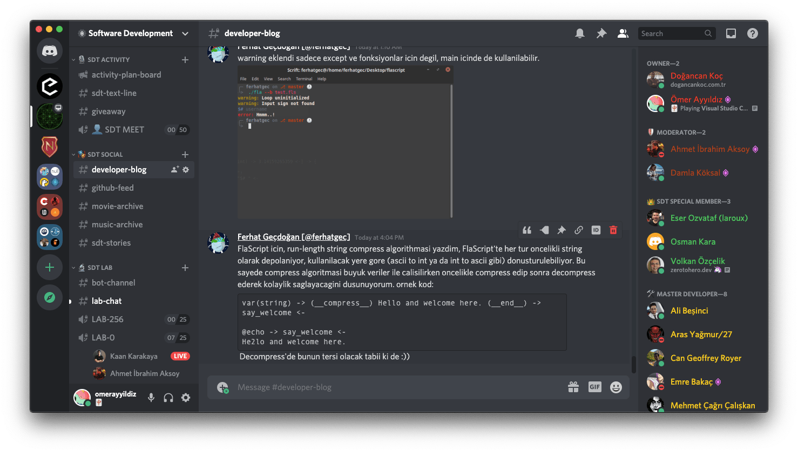

# 🎭 **SDT SOCIAL**

Bu kategoride bulunan kanallar sayesinde SDT ailesiyle sosyalleşebilirsin.

**#developer-blog:** Burada tüm üyelerimiz günlük tutabilmektedir. Başından geçen ilginç olayları, çektiğin zorlukları, başarılarını ve başarısız denemelerini burada uzun uzun yazabilirsin.

**#sdt-medium:** Medium sayfamızda paylaşılan yazıları burada herkesin göreceği şekilde paylaşıyoruz.

**#github-feed:** GitHub üzerinde geliştirdiğimiz projelerin aktivitesi bu kanalda yayınlanmaktadır. Bu kanala sadece GitHub Webhook yazılımı erişebilmektedir.

**#music-archive:** Beğendiğin müzikleri bu kanalda paylaşmakta özgürsün.

**#sdt-stories:** Etkinliklerden kesitleri, üyelerin çalışma ortamlarını, capsleri ve üyeler tarafından çekilen komik ekran resimlerini burada bulabilirsin. Rahatsız olduğun görselleri moderatörlere iletebilirsin.

**#moodboard:** Tasarımcı üyelerimiz burada yaratıcılıklarını tetikleyen çalışmaları paylaşır.
